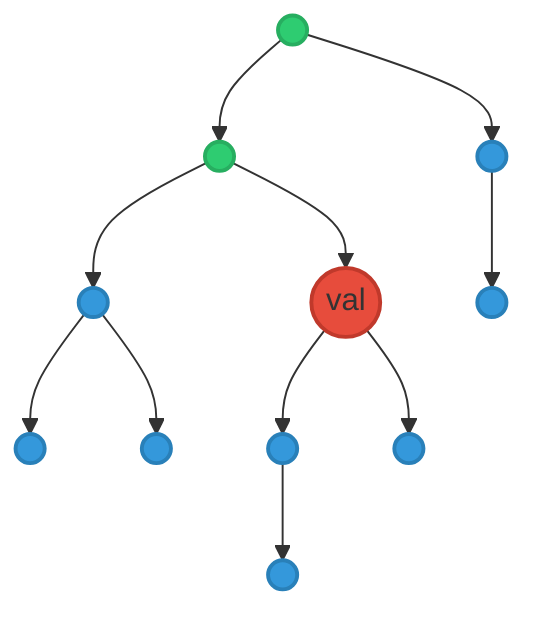
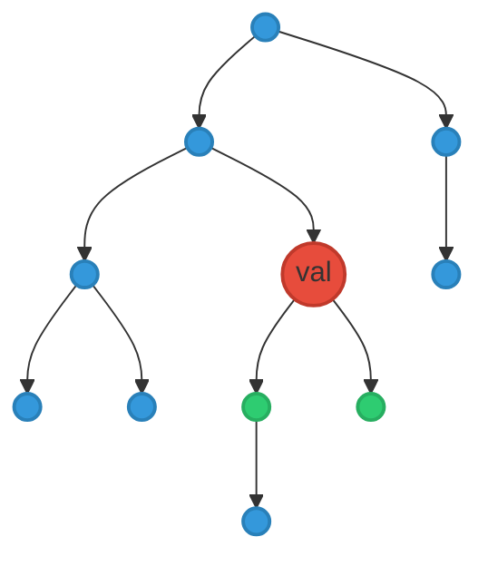
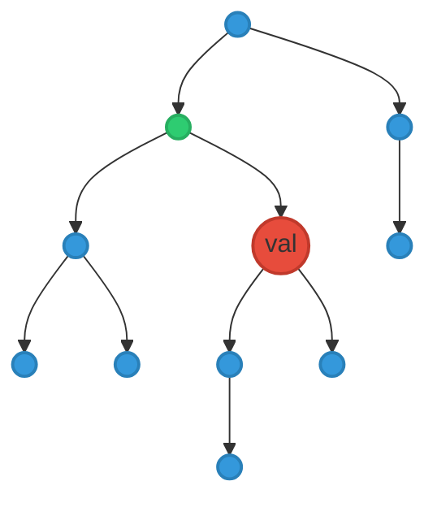

# Query
{: .no_toc }

## Table of contents
{: .no_toc .text-delta }

1. TOC
{:toc}

---

One core capability of YAMLtecture is the ability to apply a query to a configuration file to filter down to a subset of the nodes and links. This is useful for taking a single larger definition configuration and applying different queries to filter down to a subset for different use cases.

## Why Query?

A YAMLtecture configuration file is intended to represent a superset of the overall system, with all its details included. The challenge this provides is that consuming this at full detail as in creating a mermaid flowchart results in too much detail. Therefore, this information can be selected down with a query.

## Query Syntax

Queries are represented as YAML files and apply filters in the form of various operators that can take the source config file and reduce it down into the desired subset.

## Node Query Operators

Queries applied to nodes are used to select a subset of nodes based on the specified conditions. Links that have a source or target node that is not included in the query will not be included in the output.

The node query is defined by an array of `filters` that are applied to the nodes. Each filter is defined by a `condition` that has the following attributes:

- `field`: The field to be used in the filter for operators that require a field. This can be one of the fields defined below.
- `operator`: The operator to be used in the filter. This can be one of the operators defined below.
- `value`: The value to be used in the filter for comparison by operators that require a value.
- `conditions`: An array of conditions to be used in the filter. This is only used when nesting conditions with operators such as `and` or `or`.

The fields that can be used in a node query are:

- `type`
- `id`
- `parent`
- `attribute.*`

### Operator: `equals`

Filter matching only nodes where the specified field exactly matches the specified value.

```yaml
nodes:
  filters:
    - condition:
        field: type
        operator: equals
        value: "Microservice"
```

### Operator: `notEquals`

Filter matches only nodes where the specified field is not an exact match to the specified value.

```yaml
nodes:
  filters:
    - condition:
        field: type
        operator: notEquals
        value: "Microservice"
```

### Operator: `exists`

Filter matches only nodes where the specified field exists. This is intended to be used with `attribute.*` fields but can be used with any field even fields that are mandatory where it has no effect.

```yaml
nodes:
  filters:
    - condition:
        field: attribute.name
        operator: exists
```

### Operator: `and`

Filter operation that allows multiple conditions to be combined together. This is useful for more complex queries.

```yaml
nodes:
  filters:
    - condition:
        operator: and
        conditions:
          - field: type
            operator: equals
            value: "Microservice"
          - field: attribute.name
            operator: equals
            value: "Service A"
```

### Operator: `or`

Filter operation that allows multiple conditions to be combined together. This is useful for more complex queries.

```yaml
nodes:
  filters:
    - condition:
        operator: or
        conditions:
          - field: attribute.name
            operator: equals
            value: "Service A"
          - field: attribute.name
            operator: equals
            value: "Service B"
```

### Operator: `ancestorOf`

Filter operation that selects nodes that are ancestors of the specified node as defined by the `id` field. This includes the parent of the node and that parent's parent, etc.

```yaml
nodes:
  filters:
    - condition:
        operator: ancestorOf
        value: "val"
```

In the following example, the nodes highlighted in green are the ancestors of the node with the id of `val` in red.




### Operator: `descendantOf`

Filter operation that selects nodes that are descendants of the specified node as defined by the `id` field. This includes the children of the node and those children's children, etc.

```yaml
nodes:
  filters:
    - condition:
        operator: descendantOf
        value: "val"
```

In the following example, the nodes highlighted in green are the descendants of the node with the id of `val` in red.


### Operator: `childOf`

Filter operation that selects nodes that are children of the specified node as defined by the `id` field. This includes the direct children of the node.

```yaml
nodes:
  filters:
    - condition:
        operator: childOf
        value: "val"
```

In the following example, the nodes highlighted in green are the children of the node with the id of `val` in red.



### Operator: `parentOf`

Filter operation that selects the parent of the specified node, as defined by the `id` field. This includes the direct parent of the node.

```yaml
nodes:
  filters:
    - condition:
        operator: parentOf
        value: "val"
```

In the following example, the nodes highlighted in green is the parent of the node with the id of `val` in red.



## Link Query Operators

Queries applied to links are used to select a subset of links based on the specified conditions. If all links are removed from a node, that node will still be included in the output.

A link query is defined as an array of `filters` applied to the links. Each filter is defined by a `condition` that has the following attributes:

- `field`: The field to be used in the filter for operators that require a field. This can be one of the fields defined below.
- `operator`: The operator to be used in the filter. This can be one of the operators defined below.
- `value`: The value to be used in the filter for comparison by operators that require a value.
- `conditions`: An array of conditions to be used in the filter. This is only used when nesting conditions with operators such as `and` or `or`.


The fields that can be used in a node query are:

- `type`
- `source`
- `target`
- `attribute.*`

### Operator: `equals`

Filter matching only links where the specified field exactly matches the specified value.

```yaml
links:
  filters:
    - condition:
        field: type
        operator: equals
        value: "Uses"
```

### Operator: `notEquals`

Filter matches only links where the specified field is not an exact match to the specified value.

```yaml
links:
  filters:
    - condition:
        field: type
        operator: notEquals
        value: "Uses"
```


### Operator: `exists`

Filter matches only links where the specified field exists. This is intended to be used with `attribute.*` fields but can be used with any field even fields that are mandatory where it has no effect.

```yaml
links:
  filters:
    - condition:
        field: attribute.name
        operator: exists
```

### Operator: `and`

Filter operation that allows multiple conditions to be combined together. This is useful for more complex queries.

```yaml
links:
  filters:
    - condition:
        operator: and
        conditions:
          - field: type
            operator: equals
            value: "Uses"
          - field: attribute.communication
            operator: equals
            value: "Asynchronous"
```

### Operator: `or`

Filter operation that allows multiple conditions to be combined together. This is useful for more complex queries.

```yaml
links:
  filters:
    - condition:
        operator: or
        conditions:
          - field: attribute.communication
            operator: equals
            value: "Asynchronous"
          - field: attribute.communication
            operator: equals
            value: "Synchronous"
```
