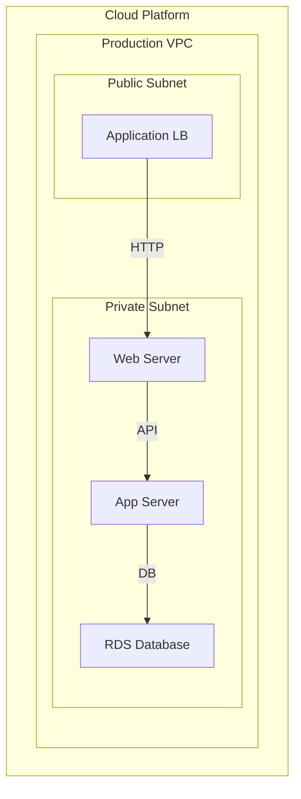

# Cloud Infrastructure
{: .no_toc }

## Table of contents
{: .no_toc .text-delta }

1. TOC
{:toc}

---

This example models a cloud infrastructure with a hierarchical network topology. It demonstrates using parent-child relationships to represent containment (cloud → VPC → subnets) and Mermaid subgraphs to visualize the hierarchy.

## Configuration

The architecture defines a cloud platform containing a VPC with public and private subnets. A load balancer sits in the public subnet, while compute instances and a database reside in the private subnet.

```yaml
nodes:
  - id: cloud
    type: Cloud
    attributes:
      name: "Cloud Platform"
  - id: vpc
    type: Network
    parent: cloud
    attributes:
      name: "Production VPC"
  - id: public_subnet
    type: Subnet
    parent: vpc
    attributes:
      name: "Public Subnet"
  - id: private_subnet
    type: Subnet
    parent: vpc
    attributes:
      name: "Private Subnet"
  - id: load_balancer
    type: LoadBalancer
    parent: public_subnet
    attributes:
      name: "Application LB"
  - id: web_server
    type: Compute
    parent: private_subnet
    attributes:
      name: "Web Server"
  - id: app_server
    type: Compute
    parent: private_subnet
    attributes:
      name: "App Server"
  - id: database
    type: Database
    parent: private_subnet
    attributes:
      name: "RDS Database"
      engine: "PostgreSQL"

links:
  - source: load_balancer
    target: web_server
    type: "HTTP"
  - source: web_server
    target: app_server
    type: "API"
  - source: app_server
    target: database
    type: "DB"
```

## Mermaid Settings

A top-down layout using node labels with subgraphs for Cloud, Network, and Subnet types to visualize the containment hierarchy.

```yaml
direction: "TD"
nodeLabel: "name"
subgraphNodes:
  filters:
    - condition:
        operator: or
        conditions:
          - field: type
            operator: equals
            value: "Cloud"
          - field: type
            operator: equals
            value: "Network"
          - field: type
            operator: equals
            value: "Subnet"
```

## Generated Diagram


