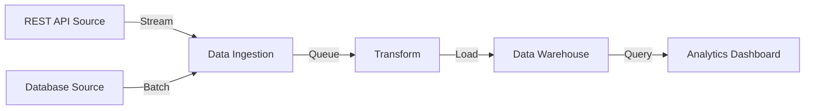
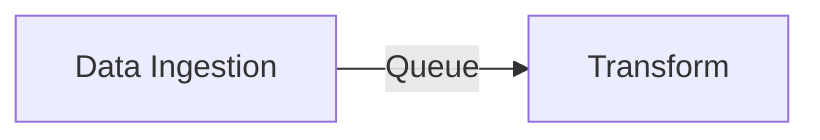

# Data Pipeline
{: .no_toc }

## Table of contents
{: .no_toc .text-delta }

1. TOC
{:toc}

---

This example models a data processing pipeline from source ingestion through transformation to a dashboard. It demonstrates using queries to filter the architecture down to a specific subset of components.

## Configuration

The pipeline defines six stages: two data sources, an ingestion layer, a transformation step, a data warehouse, and an analytics dashboard. Links represent the data flow between stages.

```yaml
nodes:
  - id: source_api
    type: Source
    attributes:
      name: "REST API Source"
  - id: source_db
    type: Source
    attributes:
      name: "Database Source"
  - id: ingestion
    type: Processing
    attributes:
      name: "Data Ingestion"
  - id: transform
    type: Processing
    attributes:
      name: "Transform"
  - id: warehouse
    type: Storage
    attributes:
      name: "Data Warehouse"
  - id: dashboard
    type: Presentation
    attributes:
      name: "Analytics Dashboard"

links:
  - source: source_api
    target: ingestion
    type: "Stream"
  - source: source_db
    target: ingestion
    type: "Batch"
  - source: ingestion
    target: transform
    type: "Queue"
  - source: transform
    target: warehouse
    type: "Load"
  - source: warehouse
    target: dashboard
    type: "Query"
```

## Mermaid Settings

```yaml
direction: "LR"
nodeLabel: "name"
```

## Full Pipeline Diagram



## Filtering with a Query

A query can be used to extract only the processing nodes from the pipeline. This is useful for focusing on the core data processing logic.

### Query

```yaml
nodes:
  filters:
    - condition:
        field: type
        operator: equals
        value: "Processing"
```

### Filtered Result

After applying the query, only the processing nodes and links between them remain:

```yaml
nodes:
    - id: ingestion
      type: Processing
      attributes:
        name: Data Ingestion
    - id: transform
      type: Processing
      attributes:
        name: Transform
links:
    - source: ingestion
      target: transform
      type: Queue
```

### Filtered Diagram


