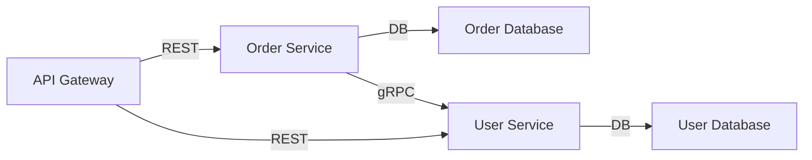

# Microservices Architecture
{: .no_toc }

## Table of contents
{: .no_toc .text-delta }

1. TOC
{:toc}

---

This example models a typical microservices architecture with an API gateway routing traffic to backend services, each backed by its own database. It demonstrates basic nodes, links, and Mermaid diagram generation.

## Configuration

The architecture defines five components: an API gateway, two microservices (User Service and Order Service), and their respective databases. Links represent REST APIs, gRPC calls, and database connections.

```yaml
nodes:
  - id: gateway
    type: Gateway
    attributes:
      name: "API Gateway"
  - id: user_service
    type: Microservice
    attributes:
      name: "User Service"
      language: "Python"
  - id: order_service
    type: Microservice
    attributes:
      name: "Order Service"
      language: "Java"
  - id: user_db
    type: Database
    attributes:
      name: "User Database"
      database: "PostgreSQL"
  - id: order_db
    type: Database
    attributes:
      name: "Order Database"
      database: "MongoDB"

links:
  - source: gateway
    target: user_service
    type: "REST"
    attributes:
      protocol: "HTTPS"
  - source: gateway
    target: order_service
    type: "REST"
    attributes:
      protocol: "HTTPS"
  - source: user_service
    target: user_db
    type: "DB"
  - source: order_service
    target: order_db
    type: "DB"
  - source: order_service
    target: user_service
    type: "gRPC"
    attributes:
      protocol: "HTTP/2"
```

## Mermaid Settings

A left-to-right layout with node labels derived from the `name` attribute.

```yaml
direction: "LR"
nodeLabel: "name"
```

## Generated Diagram


