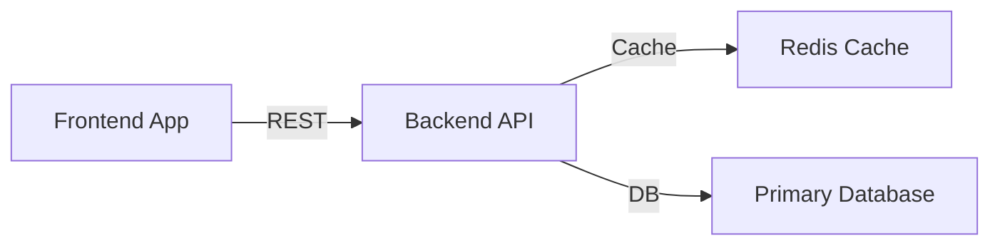

# Multi-File Configuration
{: .no_toc }

## Table of contents
{: .no_toc .text-delta }

1. TOC
{:toc}

---

This example demonstrates splitting a YAMLtecture configuration across multiple files and merging them into a single architecture. This is useful for organizing large architectures into manageable, team-owned files.

## Source Files

The configuration is split into three files in a `configs/` directory.

### services.yaml

Defines the frontend and backend services.

```yaml
nodes:
  - id: frontend
    type: Service
    attributes:
      name: "Frontend App"
      language: "TypeScript"
  - id: backend
    type: Service
    attributes:
      name: "Backend API"
      language: "Go"
```

### database.yaml

Defines the database components.

```yaml
nodes:
  - id: cache
    type: Database
    attributes:
      name: "Redis Cache"
      database: "Redis"
  - id: primary_db
    type: Database
    attributes:
      name: "Primary Database"
      database: "PostgreSQL"
```

### links.yaml

Defines the relationships between all components.

```yaml
links:
  - source: frontend
    target: backend
    type: "REST"
    attributes:
      protocol: "HTTPS"
  - source: backend
    target: cache
    type: "Cache"
  - source: backend
    target: primary_db
    type: "DB"
```

## Merging

The files are merged using the `--mergeConfig` command:

```bash
YAMLtecture --in=./configs/ --mergeConfig
```

## Merged Output

The merged configuration combines all nodes and links into a single file:

```yaml
nodes:
    - id: cache
      type: Database
      attributes:
        database: Redis
        name: Redis Cache
    - id: primary_db
      type: Database
      attributes:
        database: PostgreSQL
        name: Primary Database
    - id: frontend
      type: Service
      attributes:
        language: TypeScript
        name: Frontend App
    - id: backend
      type: Service
      attributes:
        language: Go
        name: Backend API
links:
    - source: frontend
      target: backend
      type: REST
      attributes:
        protocol: HTTPS
    - source: backend
      target: cache
      type: Cache
    - source: backend
      target: primary_db
      type: DB
```

## Mermaid Settings

```yaml
direction: "LR"
nodeLabel: "name"
```

## Generated Diagram


