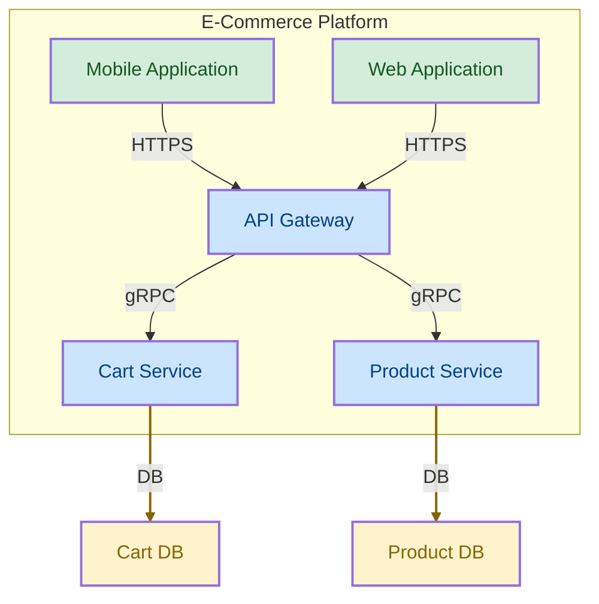

# Styled Mermaid Diagram
{: .no_toc }

## Table of contents
{: .no_toc .text-delta }

1. TOC
{:toc}

---

This example demonstrates customizing Mermaid diagram output with node styles, link styles, and subgraphs. Styling helps distinguish different component types visually and produces polished architecture diagrams.

## Configuration

The architecture models an e-commerce platform with applications, services, and databases.

```yaml
nodes:
  - id: platform
    type: Platform
    attributes:
      name: "E-Commerce Platform"
  - id: web_app
    type: Application
    parent: platform
    attributes:
      name: "Web Application"
  - id: mobile_app
    type: Application
    parent: platform
    attributes:
      name: "Mobile Application"
  - id: api_gateway
    type: Service
    parent: platform
    attributes:
      name: "API Gateway"
  - id: product_service
    type: Service
    parent: platform
    attributes:
      name: "Product Service"
  - id: cart_service
    type: Service
    parent: platform
    attributes:
      name: "Cart Service"
  - id: product_db
    type: Database
    attributes:
      name: "Product DB"
      database: "PostgreSQL"
  - id: cart_db
    type: Database
    attributes:
      name: "Cart DB"
      database: "Redis"

links:
  - source: web_app
    target: api_gateway
    type: "HTTPS"
  - source: mobile_app
    target: api_gateway
    type: "HTTPS"
  - source: api_gateway
    target: product_service
    type: "gRPC"
  - source: api_gateway
    target: cart_service
    type: "gRPC"
  - source: product_service
    target: product_db
    type: "DB"
  - source: cart_service
    target: cart_db
    type: "DB"
```

## Mermaid Settings

The settings apply:

- **Subgraphs** for Platform nodes to group related components
- **Node styles** to color-code Applications (green), Services (blue), and Databases (yellow)
- **Link styles** to highlight database connections with a distinct color

```yaml
direction: "TD"
nodeLabel: "name"
subgraphNodes:
  filters:
    - condition:
        field: type
        operator: equals
        value: "Platform"
nodeStyles:
  - filters:
      - condition:
          field: type
          operator: equals
          value: "Application"
    format:
      fill: "#d4edda"
      color: "#155724"
      stroke-width: 2px
  - filters:
      - condition:
          field: type
          operator: equals
          value: "Service"
    format:
      fill: "#cce5ff"
      color: "#004085"
      stroke-width: 2px
  - filters:
      - condition:
          field: type
          operator: equals
          value: "Database"
    format:
      fill: "#fff3cd"
      color: "#856404"
      stroke-width: 2px
linkStyles:
  - filters:
      - condition:
          field: type
          operator: equals
          value: "DB"
    format:
      stroke: "#856404"
      stroke-width: 2px
```

## Generated Diagram


